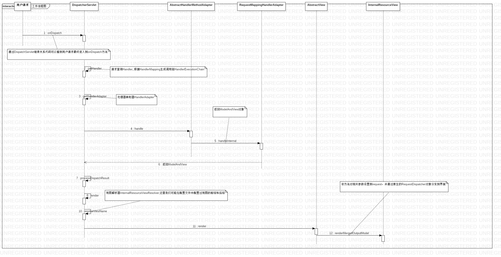

1.Spring MVC处理流程图

2.九大组件为DispatcherServlet定义的9个属性，
3.在使用Spring与Mybatis时，对象、代理对象均交由Spring容器管理，通过Bean的属性注入完成整个环境的配置，这种解耦与组合的架构方式指的更细节的去查看org.mybatis.spring.mapper.MapperScannerConfigurer源代码。
4.SpringData JPA与Mybatis之间如何权衡问题，个人还是更倾向于Mybatis半自动框架来完成更复杂的查询及映射。